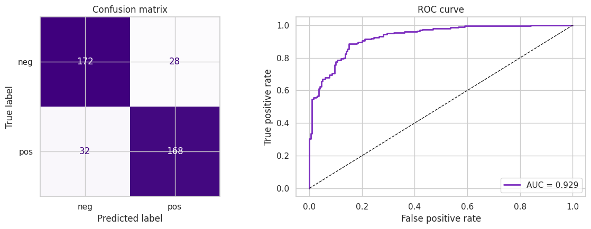

# SENTIMENT-ANALYSIS-WITH-NLP

*COMPANY*: CODTECH IT SOLUTIONS

*NAME*: VAIBHAV SINGH

*INTERN ID*: CTIS9834

*DOMAIN*: MACHINE LEARNING

*DURATION*: 8 WEEKS

*MENTOR*: NEELA SANTOSH

## Description

This project implements **sentiment analysis** on a dataset of reviews using **TF-IDF vectorization** and **Logistic Regression**. The deliverable is a Jupyter Notebook that showcases the complete NLP pipeline: text preprocessing, feature extraction, model training, and sentiment evaluation.

The notebook uses NLTK's **`movie_reviews`** corpus—2,000 real reviews labelled as positive or negative (1,000 each). Each review is cleaned, converted into a weighted bag-of-words representation with **TF-IDF**, and classified with **Logistic Regression**. The exact same pipeline works on any customer-review dataset (a CSV of review text and labels) with a one-line change.

TF-IDF (Term Frequency–Inverse Document Frequency) weights words by how important they are to a review relative to the whole corpus, and Logistic Regression is a fast, interpretable linear classifier—together they form a strong, lightweight baseline for text sentiment.

## Features

* **Text Preprocessing**: lowercasing, punctuation/number removal, and stop-word filtering
* **TF-IDF Vectorization**: unigrams **and** bigrams with a capped vocabulary
* **Logistic Regression Classifier** for binary positive/negative sentiment
* **Sentiment Evaluation**: accuracy, classification report, confusion matrix, and ROC-AUC
* **Model Interpretability**: displays the most informative positive and negative words
* **Live Prediction**: classifies brand-new sentences you provide

## Requirements

* Python 3.7+
* scikit-learn, NLTK, pandas, NumPy, Matplotlib, Seaborn
* Jupyter Notebook — or run it directly in **Google Colab** with no local setup

## Setup & Run Instructions

Clone this repository:

```bash
git clone https://github.com/Student-of-coding/sentiment-analysis-with-nlp.git
cd sentiment-analysis-with-nlp
```

Install the dependencies and launch the notebook:

```bash
pip install -r requirements.txt
jupyter notebook sentiment_analysis_nlp.ipynb
```

Or open `sentiment_analysis_nlp.ipynb` in **Google Colab** and choose *Runtime → Run all*. The corpus downloads automatically on first run.

## Usage

1. Open `sentiment_analysis_nlp.ipynb`.
2. Run all cells from top to bottom (the NLTK corpus downloads automatically).
3. Review the accuracy, confusion matrix, ROC curve, and most-informative words.
4. Edit the sample sentences in the final section to test your own reviews.

## Code Overview

* **Data Loading** — builds a DataFrame of `(review, sentiment)` from the NLTK `movie_reviews` corpus.
* **Preprocessing (`clean_text`)** — lowercases text, keeps letters only, and removes stop-words and very short tokens.
* **Train/Test Split** — stratified 80/20 split.
* **TF-IDF Vectorization** — `TfidfVectorizer` with `ngram_range=(1,2)`, fit on training data only.
* **Model Training** — `LogisticRegression` fit on the TF-IDF features.
* **Evaluation** — accuracy, `classification_report`, confusion matrix, ROC curve and AUC.
* **Interpretability & Prediction** — ranks words by coefficient weight and provides a `predict_sentiment()` helper for new text.

## Limitations & Future Work

* Bag-of-words TF-IDF ignores word order beyond bigrams and doesn't fully capture negation or sarcasm.
* No lemmatization—adding it (or spaCy) could sharpen the vocabulary.
* For higher accuracy, try `LinearSVC`, or fine-tune a transformer such as DistilBERT.

## OUTPUT


Left: confusion matrix on the test set. Right: ROC curve with a strong AUC—together showing the classifier separates positive and negative reviews well (about 85% accuracy, 0.93 AUC).



The words with the largest model weights—praise words push predictions toward positive, criticism words toward negative—confirming the model learned meaningful sentiment signal.

---

📌 **Sentiment Analysis with NLP** demonstrates a complete, interpretable text-classification pipeline using TF-IDF and Logistic Regression. Point it at your own customer reviews or upgrade the model for even higher accuracy!
